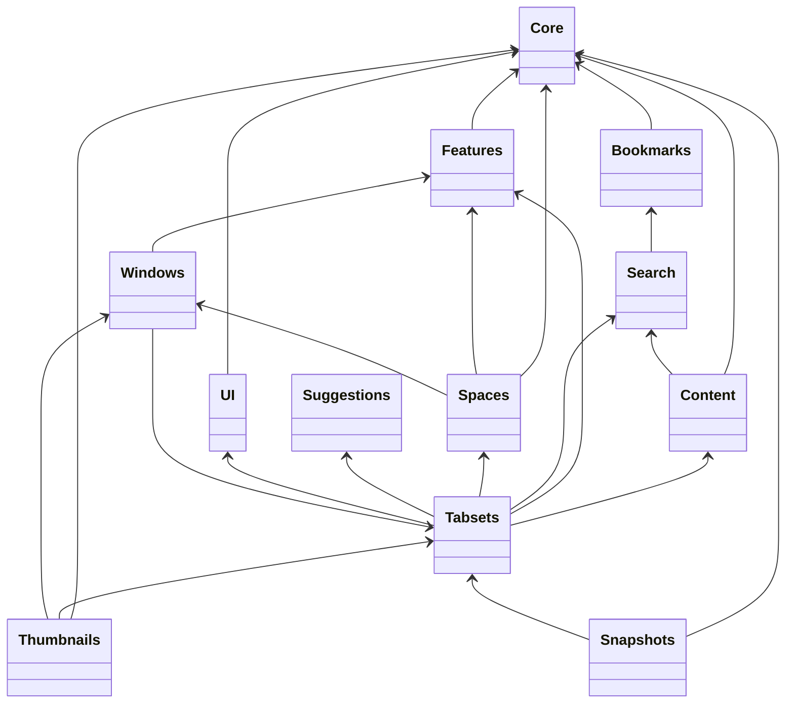

# Submodules

tabsets.net uses git submodules to share logic and UI components with other applications.

## Dependencies

read: submodule Windows depends on submodule Features etc

verfiy using something like
https://github.com/search?q=repo%3Aevandor%2Fsubmodule-spaces+src%2F&type=code

## Bookmarks

The Bookmarks Submodule lets you access your browsers bookmark API and provides some views
to use, change and delete bookmarks and folders.

This submodule is active by default in tabsets.net.

[bookmarks](bookmarks.md)

## Features

The Features Submodule provides the logic to conditionally activate (or deactivate) logic based on
the user's choice.

[features](./features.md)

## Content

## Suggestions

## Thumbnails

## Windows

The Windows Submodule provides a little ui component to list your browsers open windows.

[windows](./windows.md)

