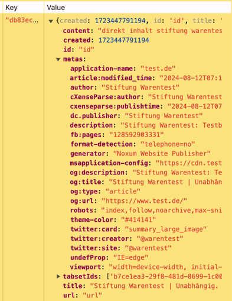

In the application, it can be called like this (here in the AddTabToTabsetCommand):

```typescript
const contentResult = await chrome.tabs.sendMessage(this.tab.chromeTabId, 'getExcerpt')
const tokens = ContentUtils.html2tokens(contentResult.html)
content = [...tokens].join(' ')
await useTabsetService().saveText(this.tab, content, contentResult.metas)
```

This will create an entry like this



The id of the entry corresponds to the tab id which was created in the AddTabToTabsetCommand.
